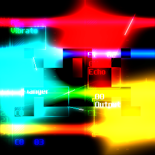
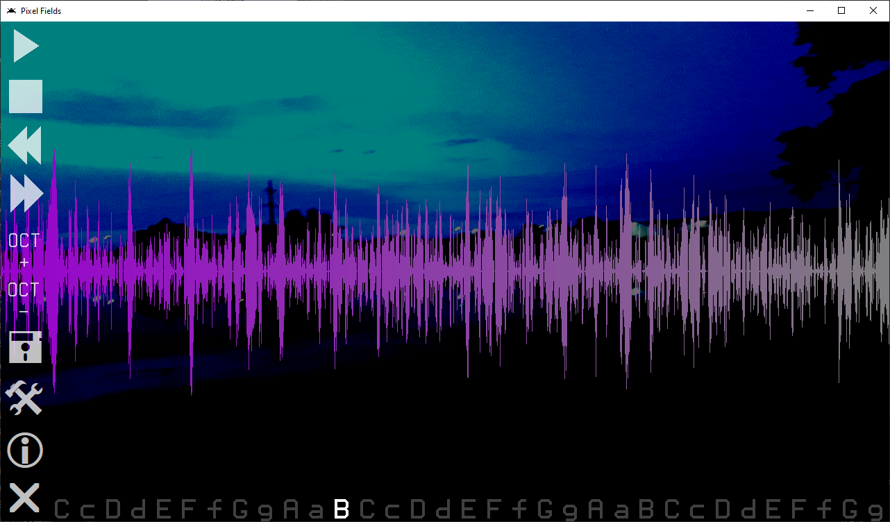

# Pixel Fields

### SunVox music player and micro synthesizer written in Pixilang

**\[[English](README.md) / [Русский](README-RU.md)\]**

---

**Pixel Fields** is one of the most **poor** project I have ever made. Pixel Fields is a "reincarnation" of [Sound Fields](https://warmplace.ru/soft/sound_fields), a wonderful music application developed by very talented musician and programmer known as [NightRadio](https://warmplace.ru). Sound Fields has not been updating since 2010 and even has been removed from App Store.\
Pixel Fields is my attempt to remake Sound Fields from scratch using [Pixilang](https://warmplace.ru/soft/pixilang) and [SunVox](https://warmplace.ru/soft/sunvox) engines which are also developed by NightRadio.

I have been developing this project since October 2022 to April 2023. The first public version was released on February, 25 of 2023 year - and that's where the project has epic failed. The project was 146,6% shitcoded, and also I have made one *very big* mistake - I was very hurried to release the first version of this piece of trash and did not fix some critical bugs that made program crash. Unhappy users - unhappy developer (me). That's why I stopped working on Pixel Fields in April 2023.

Oh, and Pixel Fields was my first and the last application available both for desktops... and mobiles!!! Pixilang is cross-platform, it supports most popular desktop and mobile platforms like Linux, Windows, macOS, Android and iOS. That's why Pixel Fields does not have any specific system requirements - just install Pixilang and have fun (lol)!

Similar to my another "abandonware" projects, Pixel Fields source code is [unlicensed](UNLICENSE.txt), so you may do everything you wish with it 😈

That's all I can say about this garbage...

